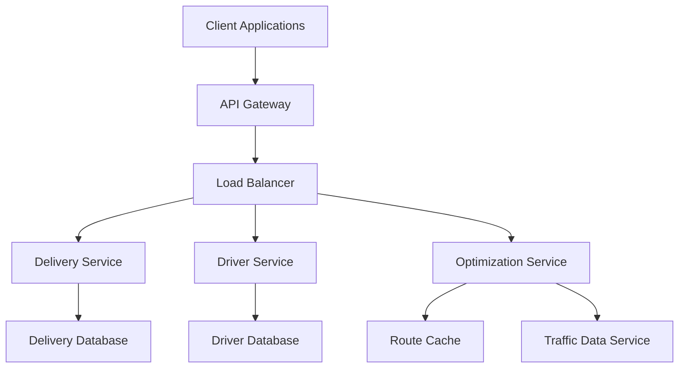
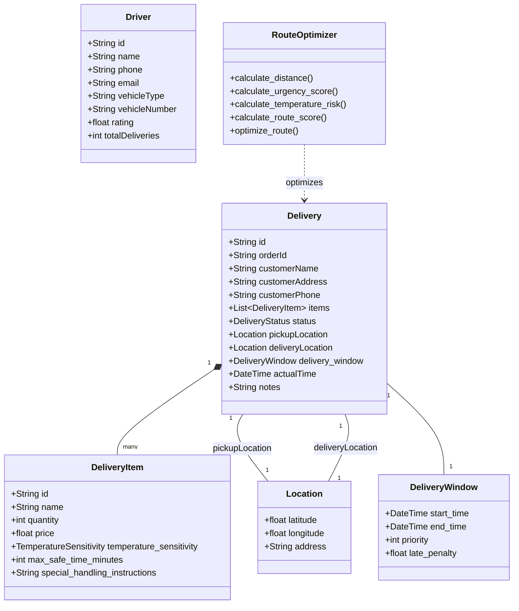
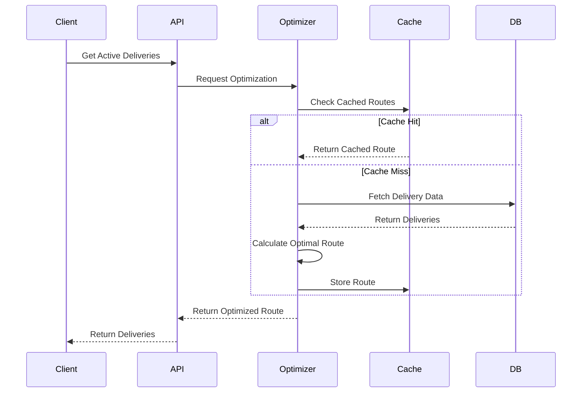
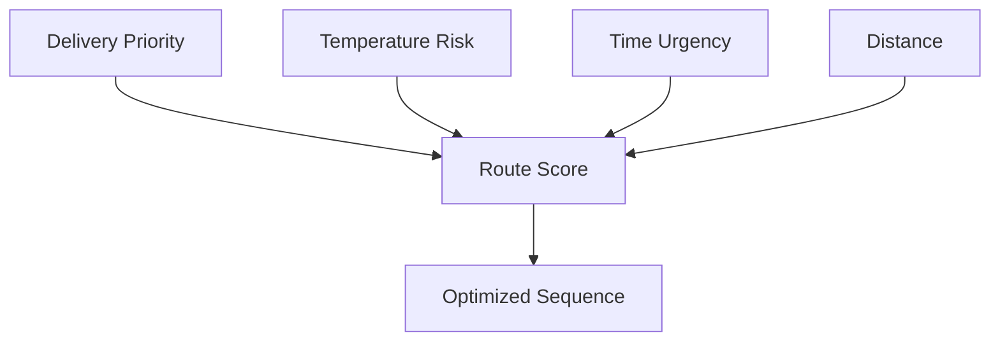

# Food Delivery Optimization System Design Documentation

## System Overview
The Food Delivery Optimization System is designed to efficiently manage and optimize delivery routes for food delivery drivers, considering multiple factors like food temperature sensitivity, delivery windows, and priority levels.

## System Architecture



### Components

1. **API Gateway**
   - Routes requests to appropriate services
   - Handles authentication and rate limiting
   - Provides API versioning

2. **Load Balancer**
   - Distributes traffic across service instances
   - Implements health checks
   - Handles failover

3. **Delivery Service**
   - Manages delivery orders and status
   - Handles delivery updates
   - Persists delivery data

4. **Driver Service**
   - Manages driver profiles and locations
   - Tracks driver availability
   - Handles driver assignments

5. **Optimization Service**
   - Implements route optimization algorithms
   - Considers multiple constraints
   - Provides real-time route updates

6. **Databases**
   - Delivery Database: Stores delivery information
   - Driver Database: Stores driver profiles and locations
   - Route Cache: Caches optimized routes

7. **Traffic Data Service**
   - Provides real-time traffic information
   - Updates route optimization parameters

## Class Diagram



## Data Flow



## Scalability Considerations

### Horizontal Scaling
1. **Service Replication**
   - Each service can be replicated across multiple instances
   - Stateless design allows for easy scaling
   - Load balancer distributes traffic

2. **Database Sharding**
   - Delivery data sharded by region
   - Driver data sharded by zone
   - Route cache distributed across regions

3. **Caching Strategy**
   - Multi-level caching:
     - In-memory cache for hot routes
     - Distributed cache for regional data
     - Database cache for persistent data

### Performance Optimization

1. **Route Caching**
   - Cache optimized routes for common patterns
   - Invalidate cache on significant changes
   - Use TTL for cache entries

2. **Batch Processing**
   - Process route updates in batches
   - Use background jobs for heavy computations
   - Implement incremental updates

3. **Real-time Updates**
   - WebSocket connections for live updates
   - Push notifications for critical changes
   - Optimistic updates for UI responsiveness

## Low Latency Measures

1. **Edge Computing**
   - Route optimization at edge locations
   - Cached routes closer to users
   - Reduced network latency

2. **Database Optimization**
   - Indexed queries for frequent operations
   - Denormalized data for common access patterns
   - Connection pooling for database access

3. **Asynchronous Processing**
   - Non-blocking I/O operations
   - Background processing for heavy tasks
   - Event-driven architecture

4. **Monitoring and Alerts**
   - Real-time performance monitoring
   - Automated scaling based on load
   - Alert system for latency spikes

## Security Considerations

1. **Authentication & Authorization**
   - JWT-based authentication
   - Role-based access control
   - API key management

2. **Data Protection**
   - Encrypted data in transit and at rest
   - Secure storage of sensitive information
   - Regular security audits

3. **Rate Limiting**
   - Per-user rate limits
   - IP-based throttling
   - Service-level quotas

## Future Enhancements

1. **Machine Learning Integration**
   - Predictive route optimization
   - Dynamic pricing based on demand
   - Driver behavior analysis

2. **Advanced Features**
   - Multi-stop optimization
   - Dynamic re-routing
   - Weather-aware routing

3. **Integration Possibilities**
   - Third-party delivery services
   - Restaurant management systems
   - Payment gateways

## Route Optimization Algorithm

### Priority Scoring System

The optimization algorithm uses a weighted scoring system that considers multiple factors to determine the optimal delivery sequence:



#### 1. Priority Factors

1. **Time Urgency Score (40% weight)**
   - Based on delivery window and current time
   - Formula: `urgency_score = (current_time - window_start) / (window_end - window_start)`
   - Higher score for deliveries closer to their deadline
   - Penalty multiplier for high-priority deliveries

2. **Temperature Risk Score (30% weight)**
   - Considers food temperature sensitivity
   - Formula: `temp_risk = (current_time - pickup_time) / max_safe_time`
   - Higher risk for temperature-sensitive items
   - Penalty for exceeding safe temperature thresholds

3. **Distance Score (30% weight)**
   - Based on distance from current location
   - Formula: `distance_score = 1 / (1 + distance_in_km)`
   - Normalized using Haversine formula
   - Considers both pickup and delivery locations

#### 2. Route Score Calculation

```python
def calculate_route_score(delivery, current_location, current_time):
    # Time urgency component
    time_ratio = (current_time - delivery.window_start) / (delivery.window_end - delivery.window_start)
    urgency_score = min(1.0, max(0.0, time_ratio)) * delivery.priority
    
    # Temperature risk component
    time_since_pickup = current_time - delivery.pickup_time
    temp_risk = min(1.0, time_since_pickup / delivery.max_safe_time)
    
    # Distance component
    distance = haversine_distance(current_location, delivery.pickup_location)
    distance_score = 1 / (1 + distance)
    
    # Weighted final score
    final_score = (
        0.4 * urgency_score +
        0.3 * (1 - temp_risk) +  # Invert temp risk for scoring
        0.3 * distance_score
    )
    
    return final_score
```

### ETA Calculation

The Estimated Time of Arrival (ETA) is computed using:

```python
def calculate_eta(delivery, current_location, current_time):
    # Base travel time (assuming average speed of 30 km/h)
    distance = haversine_distance(current_location, delivery.pickup_location)
    base_travel_time = distance / 30  # in hours
    
    # Add buffer for traffic conditions
    traffic_factor = get_traffic_factor(current_time, current_location)
    adjusted_travel_time = base_travel_time * traffic_factor
    
    # Add handling time (5 minutes per delivery)
    handling_time = 5 / 60  # in hours
    
    # Calculate final ETA
    eta = current_time + timedelta(hours=adjusted_travel_time + handling_time)
    
    return eta
```

### Assumptions and Constraints

1. **Time Assumptions**
   - Average vehicle speed: 30 km/h
   - Standard handling time: 5 minutes per delivery
   - Traffic conditions are predictable within time windows
   - No unexpected delays (accidents, road closures)

2. **Temperature Assumptions**
   - Food temperature remains constant during transit
   - Maximum safe time starts from pickup
   - Temperature-sensitive items have priority
   - No temperature control equipment failures

3. **Route Assumptions**
   - Direct routes between points
   - No one-way street restrictions
   - No parking constraints
   - No delivery location access restrictions

4. **Capacity Constraints**
   - Vehicle capacity is sufficient for all deliveries
   - No weight restrictions
   - No special handling requirements
   - No vehicle type restrictions

### Optimization Process

1. **Initial Filtering**
   - Remove completed deliveries
   - Filter by delivery window
   - Check temperature constraints

2. **Scoring Phase**
   - Calculate scores for all valid deliveries
   - Apply priority multipliers
   - Consider current location

3. **Sequencing Phase**
   - Sort deliveries by final score
   - Validate sequence against constraints
   - Adjust for time windows

4. **ETA Calculation**
   - Compute ETAs for each delivery
   - Validate against delivery windows
   - Adjust sequence if needed

### Real-time Adjustments

The system continuously monitors and adjusts routes based on:

1. **Dynamic Updates**
   - Real-time traffic conditions
   - Driver location updates
   - New delivery requests
   - Cancellations

2. **Re-optimization Triggers**
   - Significant delay in current delivery
   - New high-priority delivery
   - Temperature risk threshold exceeded
   - Traffic condition changes

3. **Fallback Strategies**
   - Alternative routes
   - Driver reassignment
   - Delivery window adjustments
   - Priority overrides 

## Design Decisions and Trade-offs

### 1. Microservices Architecture

**Decision**: Implemented a microservices-based architecture with separate services for delivery, driver, and optimization.

**Trade-offs**:
- ✅ **Pros**:
  - Independent scaling of services
  - Technology flexibility per service
  - Easier maintenance and updates
  - Better fault isolation
- ❌ **Cons**:
  - Increased operational complexity
  - Higher infrastructure costs
  - More complex deployment
  - Network latency between services

**Rationale**: Chose microservices to handle varying loads on different components (e.g., optimization service might need more resources during peak hours) and to allow independent evolution of services.

### 2. Caching Strategy

**Decision**: Implemented a multi-level caching system with in-memory, distributed, and database caches.

**Trade-offs**:
- ✅ **Pros**:
  - Reduced database load
  - Faster response times
  - Better scalability
  - Cost-effective resource usage
- ❌ **Cons**:
  - Cache invalidation complexity
  - Potential data inconsistency
  - Memory usage overhead
  - Cache management complexity

**Rationale**: Chose multi-level caching to balance between performance and consistency, with different cache levels serving different purposes (hot routes in memory, regional data in distributed cache).

### 3. Route Optimization Algorithm

**Decision**: Implemented a weighted scoring system with time urgency, temperature risk, and distance factors.

**Trade-offs**:
- ✅ **Pros**:
  - Simple to understand and maintain
  - Quick computation
  - Easy to adjust weights
  - Good enough for most cases
- ❌ **Cons**:
  - Not guaranteed optimal solution
  - May miss better routes
  - Less sophisticated than ML-based approaches
  - Fixed weight limitations

**Rationale**: Chose weighted scoring over more complex algorithms (like genetic algorithms or ML) to ensure quick response times and maintainability, while still providing good optimization results.

### 4. Real-time Updates

**Decision**: Implemented WebSocket-based real-time updates with fallback to polling.

**Trade-offs**:
- ✅ **Pros**:
  - Immediate updates
  - Reduced server load
  - Better user experience
  - Efficient bandwidth usage
- ❌ **Cons**:
  - More complex implementation
  - Higher server resource usage
  - Connection management overhead
  - Browser compatibility issues

**Rationale**: Chose WebSocket with polling fallback to ensure reliable real-time updates while maintaining compatibility with all clients.

### 5. Database Design

**Decision**: Used a combination of relational and NoSQL databases with sharding.

**Trade-offs**:
- ✅ **Pros**:
  - Optimal data structure per use case
  - Better scalability
  - Flexible schema
  - Efficient queries
- ❌ **Cons**:
  - Data consistency challenges
  - Complex synchronization
  - Higher operational complexity
  - Multiple database management

**Rationale**: Chose hybrid database approach to leverage strengths of different database types (relational for structured data, NoSQL for flexible schema and scaling).

### 6. Error Handling and Recovery

**Decision**: Implemented comprehensive error handling with automatic retries and fallback mechanisms.

**Trade-offs**:
- ✅ **Pros**:
  - System resilience
  - Better user experience
  - Reduced manual intervention
  - Graceful degradation
- ❌ **Cons**:
  - Increased code complexity
  - Higher development time
  - More testing required
  - Potential performance impact

**Rationale**: Chose comprehensive error handling to ensure system reliability and minimize service disruption, even at the cost of increased complexity.

### 7. API Design

**Decision**: RESTful API with versioning and rate limiting.

**Trade-offs**:
- ✅ **Pros**:
  - Standard and familiar
  - Easy to implement
  - Good tooling support
  - Cache-friendly
- ❌ **Cons**:
  - Over-fetching/under-fetching
  - Multiple requests for related data
  - Less efficient than GraphQL
  - Version management overhead

**Rationale**: Chose REST over GraphQL for simplicity and wide adoption, despite some efficiency trade-offs.

### 8. Monitoring and Observability

**Decision**: Implemented comprehensive monitoring with metrics, logging, and tracing.

**Trade-offs**:
- ✅ **Pros**:
  - Better system visibility
  - Quick issue detection
  - Performance insights
  - Capacity planning
- ❌ **Cons**:
  - Storage costs
  - Processing overhead
  - Data management complexity
  - Alert fatigue risk

**Rationale**: Chose comprehensive monitoring to ensure system reliability and quick issue resolution, despite the associated costs and complexity.

### 9. Security Implementation

**Decision**: Implemented JWT-based authentication with role-based access control.

**Trade-offs**:
- ✅ **Pros**:
  - Stateless authentication
  - Scalable
  - Easy to implement
  - Good performance
- ❌ **Cons**:
  - Token revocation complexity
  - Token size overhead
  - Security dependency on secret
  - Limited session control

**Rationale**: Chose JWT for its scalability and performance benefits, implementing additional measures to handle token revocation and security.

### 10. Deployment Strategy

**Decision**: Implemented blue-green deployment with canary releases.

**Trade-offs**:
- ✅ **Pros**:
  - Zero-downtime deployments
  - Easy rollback
  - Risk mitigation
  - Gradual feature rollout
- ❌ **Cons**:
  - Higher infrastructure costs
  - More complex orchestration
  - Longer deployment process
  - Resource duplication

**Rationale**: Chose blue-green with canary to ensure reliable deployments and minimize service disruption, despite the increased complexity and cost. 